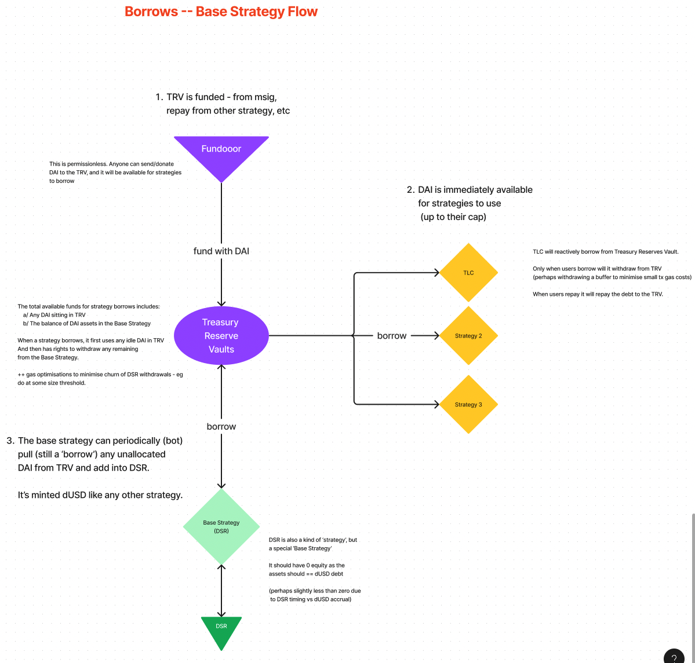
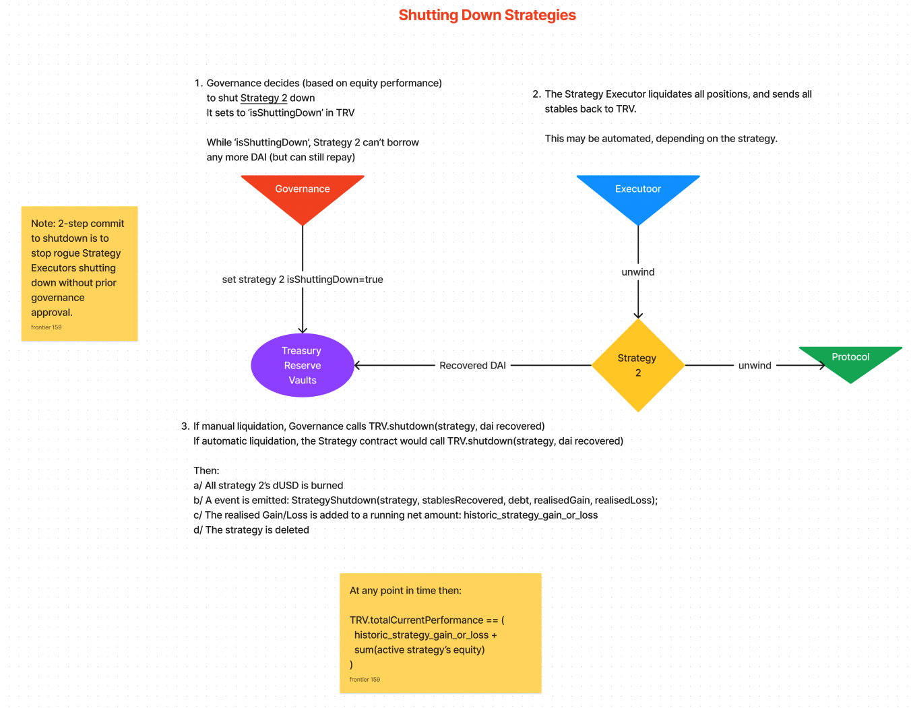

# Temple V2

- [Temple V2](#temple-v2)
  - [**VERY VERY VERY IMPORTANT**](#very-very-very-important)
  - [Contract Overview](#contract-overview)
    - [Contract Flows](#contract-flows)
      - [Strategy Borrowing From TRV](#strategy-borrowing-from-trv)
      - [Strategy Shutdown](#strategy-shutdown)
  - [Dashboard and Reporting](#dashboard-and-reporting)
  - [Elevated Access](#elevated-access)
    - [Multisig Summary](#multisig-summary)
    - [Executor - A Gnosis Safe](#executor---a-gnosis-safe)
    - [Rescuer - A Gnosis Safe](#rescuer---a-gnosis-safe)
    - [Bots](#bots)
  - [Gnosis Safe Guards](#gnosis-safe-guards)
    - [The Safe Signatory Flow is](#the-safe-signatory-flow-is)
    - [**VERY VERY VERY IMPORTANT**](#very-very-very-important-1)
      - [RISK OF BRICKING THE SAFE](#risk-of-bricking-the-safe)
      - [RISK OF DISABLING THE GUARD](#risk-of-disabling-the-guard)

## **VERY VERY VERY IMPORTANT**

[ENSURE YOU READ AND UNDERSTAND THIS](#very-very-very-important-1)

## Contract Overview

| Contract                      | Description                                                                                                                                                                                                                                                                                                                                                                                                                       |
| :---------------------------- | :-------------------------------------------------------------------------------------------------------------------------------------------------------------------------------------------------------------------------------------------------------------------------------------------------------------------------------------------------------------------------------------------------------------------------------- |
| Treasury Reserves Vault (TRV) | The central orchestration of strategies, and lender of the Temple Treasury. Strategies are added/reconfigured/shutdown via here, by Executors. Strategies borrow/repay funds from here, and this issues the dUSD to the strategy.                                                                                                                                                                                           |
| Temple Debt Token (dUSD)      | The (internal) representation of risk and opportunity cost, issued to strategies when they borrow. This debt increases each second by:   &nbsp;a/ The base rate of interest we could get (eg 1% APR for DAI’s DSR)   &nbsp;b/ An extra rate of interest determined by the DAO, given the risk of that strategy.                                                                                                          |
| DSR Base Strategy             | Any idle treasury is deposited into the DAI Savings Rate (DSR). So for this strategy, the EQUITY = ~0. Since ASSETS (DAI increasing at 1%) == LIABILITIES (dUSD increasing at 1%) When any other strategy borrows from the TRV, it will withdraw the funds from this base strategy (with some buffer for gas optimisation).                                                                                                 |
| Strategy N (of M)             | Each separate implementation of a strategy. This:   &nbsp;a/ Reports the assets in the strategy for reporting purposes   &nbsp;b/ Implements any automation required for the strategy - borrow/repay/deploy funds/withdraw liquidity/etc It may be as simple as a wrapper over a Gnosis Safe (where executors are the signer of this Safe), or as partially/fully automated, where a bot can interact with the strategy. |

### Contract Flows

[From Figma](https://www.figma.com/file/19byxwXyDXB9b8toLKl40Y/Temple-v2?type=whiteboard&node-id=0-1&t=BbsTv2Dtcz91vhvy-0)

#### Strategy Borrowing From TRV

#### Strategy Shutdown

## Dashboard and Reporting

Each Strategy will be able to report:

1. ASSETS: The total USD equivalent of the stables borrowed and deployed into the underlying strategy protocols
2. LIABILITIES: The current dUSD (risk adjusted) debt
3. EQUITY: ASSETS - LIABILITIES

Subgraph can pick this info up and track performance over time. So:

- Performance can be compared, track over time
- Decisions can be made if the strategy should should be liquidated (underperforming), borrow more, etc

Note: This dashboard may introduce functionality to call specific functions on the contracts over time, but functions such as liquidations will remain a manual Executor decision.

## Elevated Access

Each of the above contracts can only be updated by DAO nominated addresses. Categorising as 'actors' they may be multi-sig Gnosis Safe's or bot EOAs for automation.

The scope of this document doesn't describe how the owners of the Safe are chosen, or the required permission level of each capability. Here we are only concerned by the mechanics once those have been decided by the DAO.

This access is implemented using the **Temple Elevated Access** abstract base contract.

### Multisig Summary

| Multisig | Signer Threshold                         | Safe Guards     |
| :------- | :--------------------------------------- | :-------------- |
| Executor | 2+/X - dependant on contract method call | Threshold Guard |
| Rescuer  | 2/X                                      | NONE            |

### Executor - A Gnosis Safe

The Executor enacts the will of the DAO. Signers on this multisig are trusted, and know in depth how to execute on the strategies.

They wear multiple hats:

1. **Administration**:
   1. Critical functions for administration purposes.
   2. eg Add new strategies, update the base dUSD interest rate, update strategy parameters, apply the strategy borrow caps
2. **Strategy Operations**:
   1. For each strategy, there will be some management required - may be daily/weekly/etc depending on the strategy.
   2. eg Borrow more funds or repay, apply funds in strategy, etc

Each of these functions will require **at least 2** signers in the multisig:

1. Within the Gnosis Safe, the required signer threshold is set to 2.
2. Some of the functions will require **more than 2** signers. This is controlled via a *Gnosis Safe Guard*, detailed below.

### Rescuer - A Gnosis Safe

The Rescuer acts as an on-call backup in case of emergency. Signers on this multisig are trusted, well respected members of the DAO (who have skin in the game).

2 signers are required on the Rescuer multisig. As part of the emergency, they may elect to temporarily add more signers to the multisig - eg adding executors on such that the people in the know can help in the emergency.

Each of the contracts can be set to 'rescue mode', by either the Executor or the Rescuer multisig. When in rescue mode, the Executor loses its rights, and the Rescuer is granted those rights.

A full Post Incident Response will be written up any time Rescue Mode is enabled.

### Bots

In order to enable automation, access can be granted to certain addresses, on a per-function basis. So this can be used to say allow a bot to call one or two functions only on one of the strategies.

This access can be granted by the Executor, but given it's an important Administration method, it will require >2 signers.

## Gnosis Safe Guards

We use a [Safe Transaction Guard](https://help.safe.global/en/articles/5324092-what-is-a-transaction-guard) in order to verify that MORE than just the base Safe threshold of owners have signed a transaction.

The signer threshold in the Safe needs to be at least 2. The guard can then have a default (if the threshold for the `contract.function()` isn't explicitly defined in the guard). Then on a per `contract.function()` basis, a specific threshold that's required can be defined.

For example:

- Safe Threshold: 2/X
- Guard Default Threshold: 3/X
- `strategyA.weeklyOperationalThing()` Threshold: 2/X
- `TRV.setBaseRate()` Threshold: 4/X

That means by default all operations will need 3/X, unless otherwise explicitly set per function.

### The Safe Signatory Flow is

1. **For a 2/X required function**:
   1. An owner proposes a transaction, and signs it in Safe UI (1/X)
      1. A Tenderly simulation can be run at this point
   2. A subsequent owner signs this transaction in Safe UI (2/X)
      1. This can be executed immediately
2. **For a 3+/X required function**:
   1. An owner proposes a transaction, and signs it in Safe UI (1/X)
      1. A Tenderly simulation can be run at this point
   2. A subsequent owner signs this transaction in Safe UI (2/X)
      1. The function CANNOT be executed. Safe will report this as going to fail, with the error message: *"Dynamic Signature Threshold Not Met"*
   3. A 3rd owner needs to sign using the Temple Dapp
      1. They can't sign using the Safe UI (only execute function is allowed...)
      2. We can sign using the Safe SDK though, that we can bake into the Temple Dapp
   4. Any owner can then execute using the Safe UI
      1. and/or the Temple Dapp via the Safe SDK

### **VERY VERY VERY IMPORTANT**

#### RISK OF BRICKING THE SAFE

The functions on this Guard are protected. It is super super super important to have the elevated access of this granted to a multisig which IS NOT the Safe which this is guarding for.

Otherwise it may end up in a situation where the guard is blocking the execution transactions of the Safe, but we cannot disable the guard.

#### RISK OF DISABLING THE GUARD

The Threshold in the Safe should always be 2+. If it is set to 1, then it effectively disables any further signatory checking in the Guard.

Reason: In order to run Tenderly simulations successfully, Safe overrides t he threshold=1. So in order to make simulations succeed, we need to disable any further signatory checks.
