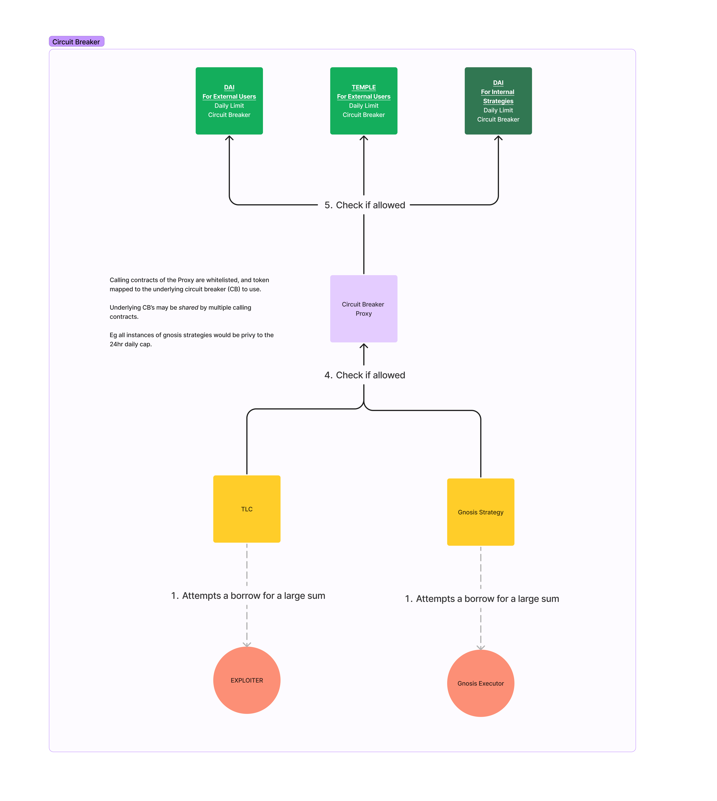

# Temple V2

- [Temple V2](#temple-v2)
  - [**VERY VERY VERY IMPORTANT**](#very-very-very-important)
  - [Contract Overview](#contract-overview)
    - [Contract Flows](#contract-flows)
  - [Dashboard and Reporting](#dashboard-and-reporting)
  - [Temple Elevated Access](#temple-elevated-access)
    - [Multisig Summary](#multisig-summary)
    - [Executor - A Gnosis Safe](#executor---a-gnosis-safe)
    - [Rescuer - A Gnosis Safe](#rescuer---a-gnosis-safe)
    - [Bots](#bots)
  - [Gnosis Safe Guards](#gnosis-safe-guards)
    - [The Safe Signatory Flow is](#the-safe-signatory-flow-is)
    - [**VERY VERY VERY IMPORTANT**](#very-very-very-important-1)
      - [RISK OF BRICKING THE SAFE](#risk-of-bricking-the-safe)
      - [RISK OF DISABLING THE GUARD](#risk-of-disabling-the-guard)
  - [Contract Permissions](#contract-permissions)
  - [Circuit Breakers](#circuit-breakers)
    - [Implementation of the 24hr Circuit Breaker](#implementation-of-the-24hr-circuit-breaker)

## **VERY VERY VERY IMPORTANT**

[ENSURE YOU READ AND UNDERSTAND THIS](#very-very-very-important-1)

## Contract Overview

| Contract                      | Description                                                                                                                                                                                                                                                                                                                                                                                                                       |
| :---------------------------- | :-------------------------------------------------------------------------------------------------------------------------------------------------------------------------------------------------------------------------------------------------------------------------------------------------------------------------------------------------------------------------------------------------------------------------------- |
| Treasury Reserves Vault (TRV) | The central orchestration of strategies and lender of the Temple Treasury. Strategies are added/reconfigured/shutdown via this contract by the Executor. Strategies borrow/repay funds from the TRV contract, which also issues the Temple Debt Token (dUSD, dTEMPLE, etc) to the Strategy borrower.|
| Temple Debt Token (dToken)      | Treasury's internal accounting unit used to quantify risk and opportunity cost for funds allocated to Strategy Borrowers. This debt token increases each second by:   &nbsp;a/ The baseline rate of interest in the system, or the risk-free rate we could get (eg 3.49% APR for Maker's Dai Savings Rate)   &nbsp;b/ plus an additional risk premium rate determined by the DAO, given the idiosyncratic risk of that Strategy.                                                                                                          |
| DSR Base Strategy             | Idle treasury funds are deposited into the DAI Savings Rate (DSR) vault. For this baseline strategy, the net EQUITY will always be approximately 0 since ASSETS (DAI earning yield at 3.49% rate) == LIABILITIES (dUSD also increasing at 3.49% rate) When any other non-Base Strategy borrows from the TRV, the funds will be withdrawn from this Base Strategy (with some buffer for gas optimisation).                                                                                                 |
| Strategy N (of M)             | Each separate implementation of a strategy to generate returns. The Strategy shall:   &nbsp;a/ Report the assets currently deployed in the strategy for bookkeeping purposes   &nbsp;b/ Implements any automation required for the strategy - borrow/repay/deploy funds/withdraw liquidity/compound etc A Strategy may be as simple as a wrapper over a Gnosis Safe (where Executors are the owners of this Safe), or alternatively as partially/fully automated, where a bot can interact with the Strategy to perform upkeep. |

### Contract Flows

[From Figma](https://www.figma.com/file/czWJyDLeZ5vokSmg8JKNOd/Temple-V2---High-Level?type=whiteboard&node-id=0-1&t=VGQ5UfayDstr0MoK-0)

1. [High Level:](https://www.figma.com/file/czWJyDLeZ5vokSmg8JKNOd/Temple-V2---High-Level?type=whiteboard&node-id=0-1&t=VGQ5UfayDstr0MoK-0)

2. [RAMOS](https://www.figma.com/file/PpvTnkCXCjBYGG4PEfPX0g/Temple-v2---RAMOS-Flow?type=whiteboard&node-id=0%3A1&t=xJABbrEtpqo2d4rk-1)
3. [TLC](https://www.figma.com/file/IRKfmaIiqGbb5NJNnG0RII/Temple-v2---TLC?type=whiteboard&node-id=0%3A1&t=q86NARTNHGl83HGj-1)
4. [Gnosis Strategy](https://www.figma.com/file/jz0TZj6Zb6Mzbx0VyKznGH/Temple-v2---Gnosis-Safe-Strategy?type=whiteboard&node-id=0%3A1&t=TFUxOLbwq60PMN2J-1)
5. [Strategy Shutdown](./Shutdown.png)

## Dashboard and Reporting

Each Strategy contract will report it's on-chain:

1. ASSETS: Any token balances it holds, or is deployed into an external protocol, which should be counted as an asset.
2. LIABILITIES: The amount of internal debt tokens (dTOKENS) which that strategy owes the Treasury Reserves Vault (TRV).
   1. These dTokens rebase at the APR of the Base Strategy plus an idiosyncratic risk premium rate.

From these balances, we can then calculate the performance of each strategy.

1. ASSETS: The total USD equivalent value of the assets reported by the Strategy.
2. LIABILITIES: The outstanding USD equivalent of the dTokens owed.
3. EQUITY: ASSETS - LIABILITIES

A Subgraph will index the Strategy contract and track performance over time such that:

- Performance can be discounted by risk and opportunity cost and compared to peers
- Data-informed decisions can be made if the Strategy should be liquidated due to underperformance, or scaled up with more borrowing

Note: In the future, the Treasury dashboard may introduce functionality to call specific functions in the contracts, but functions like liquidations will remain a manual Executor operation directed by governance.

## Temple Elevated Access

The details of how the owners of the Safe are chosen and the required permission level of each capability are beyond the scope of this document. Here we are only focused on the mechanics of how a Strategy is managed once those initial decisions have been stipulated by the DAO.

Each of the above contracts can only be updated by one or more DAO designated addresses that we categorise here as 'actors'. Actors may be multi-sig Gnosis Safes or bot EOAs for automation.

This access is implemented using the **Temple Elevated Access** abstract base contract.

### Multisig Summary

| Multisig | Signer Threshold                         | Safe Guards     |
| :------- | :--------------------------------------- | :-------------- |
| Executor | 2+/X - dependent on contract method call | Threshold Guard |
| Rescuer  | 2/X                                      | NONE            |

### Executor - A Gnosis Safe

The Executor Gnosis enacts the will of the DAO. Signers on this Multisig are trusted members of the community who have demonstrated high integrity and technical knowledge to execute Strategy operations. These signers do not have agency over Executor actions beyond committing to the blockchain the decisions approved by the DAO, or as part of the implementation for that Specific strategy. An Executore who act on their own outside of governance or the scope of the Strategy may be removed by the other Executors.

The Executor serves multiple roles:

1. **Administrative Operations**:
   1. Call critical functions for Administration purposes.
   2. Examples: Add new Strategies, update the base interest rate for dUSD, update the risk premium rate, apply the strategy borrow caps
2. **Strategy Operations**:
   1. For each strategy, some position management may be required on a daily/weekly/monthly basis depending on the Strategy.
   2. eg Borrow more funds or repay, Deploy funds, Liquidate to paydown dUSD debt, etc

Each of these functions will require **at least 2** signers in the Executor multisig:

1. Within the Executor Gnosis Safe, the required signer threshold is set to 2.
2. Some of the Strategy or TRV functions will require **more than 2** signers. This is controlled via a *Gnosis Safe Guard* as detailed below.

### Rescuer - A Gnosis Safe

The Rescuer acts as an on-call backup operator of the Strategy in case of emergency. Signers on this multisig are highly trusted members of the DAO who have demonstrated proficiency with dApp and contract interactions, and a track record of putting the best interests of the DAO first. These signers should meet minimum time requirements in terms of being available online.

Each of the Strategy contracts can be set to 'rescue mode', by either the Executor or the Rescuer multisig. When a Strategy is in Rescue mode, the Executor loses its permissions, and the Rescuer is granted those same permissions.

Two (2) signers are required on the Rescuer multisig to send a transaction. As part of the emergency, the Rescuer signers may elect to temporarily add more signers - i.e. adding more Executors or other owners to the Safe such that the Rescuers can quickly onboard the experts who can provide technical support.

A full Post Mortem Report should be written up any time Rescue Mode is enabled to debrief the community about the incident.

### Bots

In order to facilitate automation, contract access can be granted as feasible to certain addresses on a per-function basis. Granting access would allow a bot to call some of the functions on one or more of the Strategies.

This supplemental access can be granted by the Executor, but given it is an important Administration method, granting this access will trigger elevated signature requirement (3+) on the Executor.

## Gnosis Safe Guards

We use a [Safe Transaction Guard](https://help.safe.global/en/articles/5324092-what-is-a-transaction-guard) in order to verify that MORE than just the base threshold (2) of Safe owners have signed a particular transaction that affect critical functions or parameters.

For normal transactions, the signer threshold in the Safe needs to be at least 2. The Safe Guard can then have a default threshold (if the threshold for the `contract.function()` is not explicitly defined in the guard). Then on a per `contract.function()` basis, a specific threshold that is required can be defined e.g. at least 3 signers.

For Example:

- Safe Threshold: 2/X
- Guard Default Threshold: 3/X
- `strategyA.weeklyOperationalThing()` Threshold: 2/X
- `TRV.setBaseRate()` Threshold: 4/X

In this specific example above, by default, the Safe Guard will require 3/X signatures except for the specific Strategy functions where the Threshold was explicitly set to 2/X or 4/X to override the Default.

### The Safe Signatory Flow is

1. **For a 2/X required function**:
   1. An owner proposes a transaction, and signs it in Safe UI (1/X)
      1. A Tenderly simulation can be run at this point
   2. A second owner signs this transaction in Safe UI (2/X)
      1. This can be executed immediately
2. **For a 3+/X required function**:
   1. An owner proposes a transaction and signs it in Safe UI (1/X)
      1. A Tenderly simulation can be run at this point
   2. A second owner signs this transaction in Safe UI (2/X)
      1. The function CANNOT be executed. Safe will report this as going to fail, with the error message: *"Dynamic Signature Threshold Not Met"*
   3. A third owner needs to sign using the Temple dApp
      1. The third owner can't sign using the Safe UI (only execute function is allowed...)
      2. The third owner can sign using the Safe SDK that we can bake into the Temple dApp
   4. Any owner on the Safe can then execute using the Safe UI
      1. and/or the Temple dApp via the Safe SDK

### **VERY VERY VERY IMPORTANT**

#### RISK OF BRICKING THE SAFE

The functions on this Guard are protected. It is super super super important to have the elevated access of the Guard granted to a Multisig which IS NOT the Safe which on which the Guard is applied.

Otherwise a situation could arise where the Guard is blocking the execution transactions of the Safe, but we cannot disable the Guard which would render the underlying Safe unusable.

#### RISK OF DISABLING THE GUARD

The Threshold in the Safe should always be 2+. If it is set to 1, then it effectively disables any further signatory checking in the Guard.

Reason: In order to run Tenderly simulations successfully, Safe overrides the threshold=1. So in order to make simulations succeed, we need to disable any further signatory checks.

## Contract Permissions

Proposed permissions for the Contract functions [are listed in this spreadsheet](https://docs.google.com/spreadsheets/d/1H6-cZLsxgIDg_CNmU4syTHJ9Df5jsGFAg2yh9klIEkw/edit#gid=1843345640)

Where `onlyElevatedAccess` is noted in column G, the number of Executor signers for that function is listed in column H.

To implement this:

- `ThresholdSafeGuard` would have a `defaultSignaturesThreshold` of 3
- `ThresholdSafeGuard` would have `setFunctionThreshold()` set for each of the functions listed with `executor signers = 2`

## Circuit Breakers

Temple has incorporated a circuit breaker for certain functions to provide limited liability in case of an emergency.

[Figma Link](https://www.figma.com/file/dyDcHid2C6yMDIqwNaGP4k/Temple-V2---Circuit-Breakers?type=whiteboard&node-id=0-1&t=jnPuDD8FeF1iqMXS-0)

Over time, there may be multiple types of circuit breaker implementations. As of writing, we have just one.

This tracks the total funds requested for a single token over a window of time. If the total amount requested is greater than the cap (for that period) then it reverts the transaction.

### Implementation of the 24hr Circuit Breaker

tl;dr No more than the cap can be borrowed within a 23-24 hour window (not exactly 24hrs)

For efficiency to avoid looping over large data sets, this employs a bucketing algorithm.

1. The tracking is split up into hourly buckets, so for a 24 hour window, we define 24 hourly buckets.
2. When a new transaction is checked, it will roll forward by the required buckets (when it gets to 23 it will circle back from 0), cleaning up the buckets which are now > 24hrs in the past.
   1. If it's in the same hr as last time, then nothing to clean up
3. Then adds the new volume into the bucket
4. Then sums the buckets up and checks vs the cap, reverting if over.

This means that we only have to sum up 24 items.

The compromise is that the window we check for is going to be somewhere between 23hrs and 24hrs.
eg for a cap of 100:

- at 13:45:00 borrow 75 (OK - utilisation == 75)
  - bucket 13 = 75
- at 23:06:00 borrow 25 (OK - utilisation == 100)
  - bucket 13 = 75
  - bucket 23 = 25
- at 12:59:59 borrow 1  (FAIL - utilisation == 101)
  - bucket 13 = 75
  - bucket 23 = 25
  - bucket 12 = 1  (discarded on the revert)
- at 13:00:00 borrow 1  (OK - utilisation == 26)
  - bucket 23 = 25
  - bucket 13 = 1  (the old value at bucket 13 was removed, now have the new value)

Because the last trade crossed into the new window (on the hour) it was ok.

We can make the number of buckets more granular (configurable) -- eg 48 buckets. But it makes a decent difference to the gas required (more things to loop over).
     24 buckets (hourly): 11k gas
     48 buckets (half hourly): 17.5k gas
